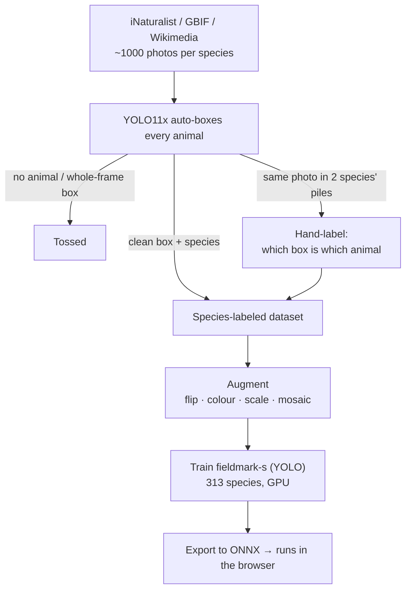

# Fieldmark 🐦

Point your phone at a Finnish bird or mammal — or record its call — and it tells you
what it is, right there in the browser, no server round-trip. Log it, rack up points,
chase missions, and compete with whoever you've roped into spotting with you. 313
species, birds and mammals.

PWA on GitHub Pages; Supabase handles the shared stuff (login, sightings, leaderboard).
It's rate-limited, so you need an account to use it.

## What you can do

- 📸 Snap a photo → species ID
- 🔊 Record a call, or drop in an audio/video clip → species ID via BirdNET
- 📓 Build a dex, see where things were spotted and who found what
- 🎯 Missions: first bird, ID-by-sound, co-op spots, and ones that stay locked until
  you've earned them
- 🗺️ Map, leaderboard, works offline

## The dataset

Most "is this a bird?" apps lean on a plain CNN classifier, and that bugged me: a
classifier tells you *there's a bird* but not *where it is*, and it falls apart the
moment two animals share a frame. So this is built for **YOLO** — every training image
carries **bounding boxes around the actual animals**, so the model learns to point at
each one, not just shrug "yep, bird."

Building it, per species:

1. **Pull ~1000 photos** from open sources — iNaturalist first (community-verified IDs),
   then GBIF (live observations only, no pinned museum specimens), then Wikimedia for
   the rare stragglers.
2. **Auto-box every photo** with a general detector (YOLO11x): a tight box on each
   animal. No animal found → **tossed**. Lazy whole-frame "boxes" → tossed too.
3. **Label each box** with the species the photo was pulled for.
4. **The only thing we hand-label**: photos that show up in *more than one* species'
   pile — the exact same image pulled for two species. That's either a mis-ID or a frame
   with two different animals in it, so a human looks at it and says which **box belongs
   to which animal**. Everything else is automatic.
5. **Top up** the thin species until everyone has enough.

Out comes a clean, species-labeled detection set: hundreds of real, boxed examples per
species.

## Models

Both run on-device in the browser (WebGPU, falling back to WASM):

- **fieldmark-s** — *our* YOLO detector, trained on the dataset above. This is the one
  we build and retrain.
- **BirdNET** — an off-the-shelf, already-pretrained bird-sound model; we just map its
  output onto our 313 species.

Hand-label more shared photos in the app → they feed back into the dataset → retrain
fieldmark-s.
