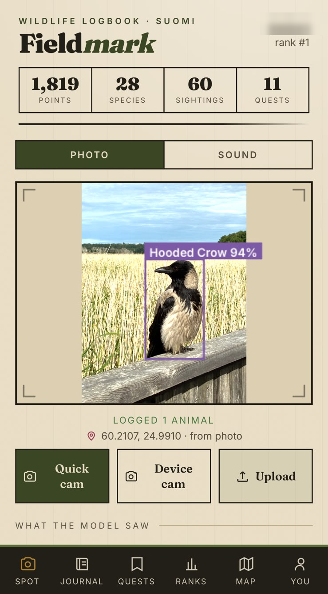
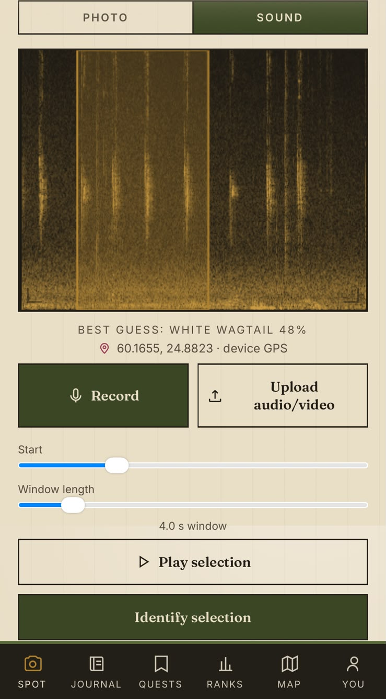
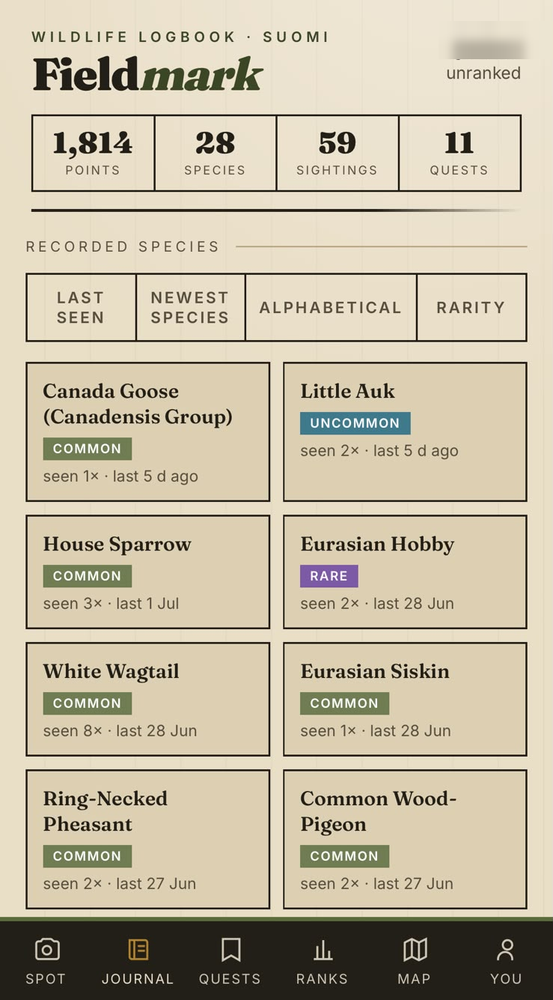
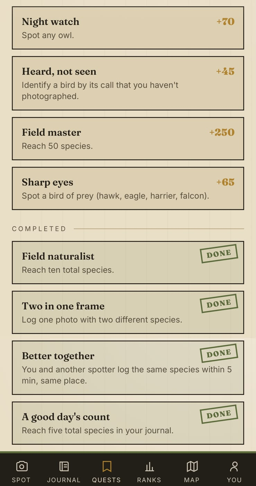
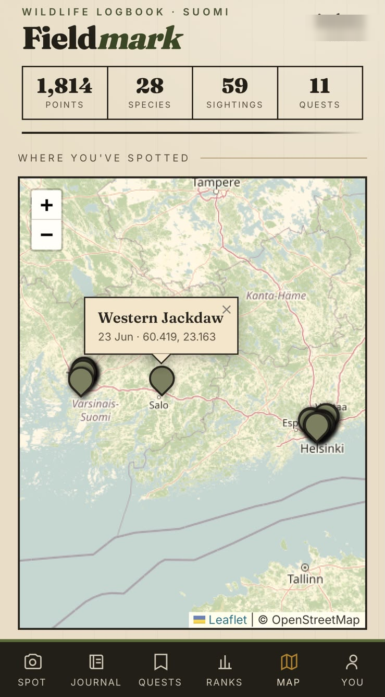
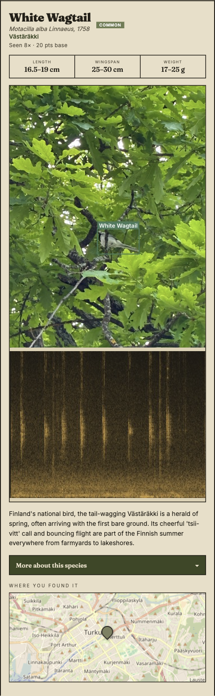
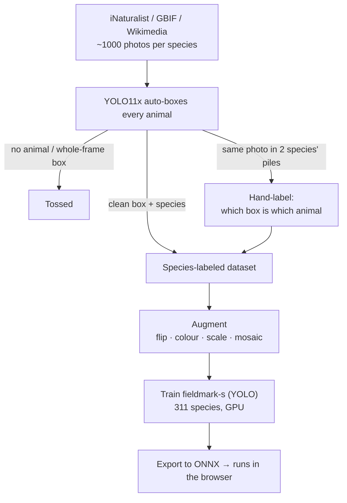
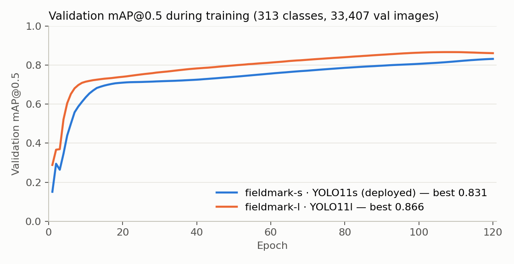
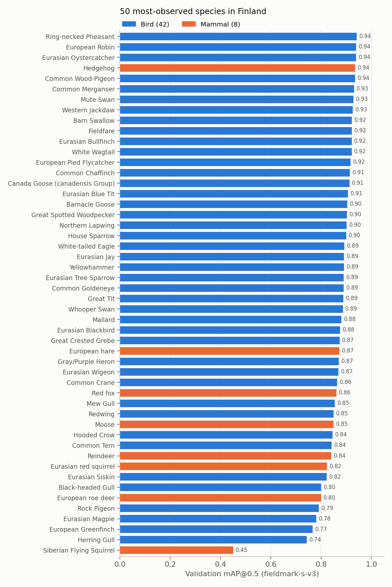

# Fieldmark 🐦

Point your phone at a Finnish bird or mammal — or record its call — and it tells you
what it is, right there in the browser, no server round-trip. Log it, rack up points,
chase missions, and compete with whoever you've roped into spotting with you. 311
species, birds and mammals.

PWA on GitHub Pages; Supabase handles the shared stuff (login, cross-device sync,
leaderboard). You can also **continue without logging in** — local-only mode keeps
every sighting in the device's cache and never touches a server.

## Run your own

The app is a static PWA — serve `index.html` from anywhere (GitHub Pages works).
For login + sync + leaderboard, spin up a free Supabase project and run the three
SQL scripts in [`db/`](db/); full walkthrough in [`db/SETUP.md`](db/SETUP.md). Skip
all of it and use local-only mode if you just want to try it.

## Screenshots

<table>
  <tr>
    <td align="center"> <b>Spot</b> — photo → species ID</td>
    <td align="center"> <b>Sound</b> — record a call → BirdNET</td>
    <td align="center"> <b>Journal</b> — your recorded species</td>
  </tr>
  <tr>
    <td align="center"> <b>Quests</b> — missions & assignments</td>
    <td align="center"> <b>Map</b> — where you've spotted</td>
    <td align="center"> <b>Species page</b> — photo, call, stats, map</td>
  </tr>
</table>

## What you can do

- 📸 Snap a photo → species ID
- 🔊 Record a call, or drop in an audio/video clip → species ID via BirdNET
- 📓 Build a dex, see where things were spotted and who found what
- 🎯 Missions: first bird, ID-by-sound, co-op spots, and ones that stay locked until
  you've earned them
- 🗺️ Map, leaderboard, works offline

## The dataset

Most "is this a bird?" apps lean on a plain CNN classifier, and that bugged me: a
classifier tells you *there's a bird* but not *where it is*, and it falls apart the
moment two animals share a frame. So this is built for **YOLO** — every training image
carries **bounding boxes around the actual animals**, so the model learns to point at
each one, not just shrug "yep, bird."

Building it, per species:

1. **Pull ~1000 photos** from open sources — iNaturalist first (community-verified IDs),
   then GBIF (live observations only, no pinned museum specimens), then Wikimedia for
   the rare stragglers.
2. **Auto-box every photo** with a general detector (YOLO11x): a tight box on each
   animal. No animal found → **tossed**. Lazy whole-frame "boxes" → tossed too.
3. **Label each box** with the species the photo was pulled for.
4. **The only thing we hand-label**: photos that show up in *more than one* species'
   pile — the exact same image pulled for two species. That's either a mis-ID or a frame
   with two different animals in it, so a human looks at it and says which **box belongs
   to which animal**. Everything else is automatic.
5. **Top up** the thin species until everyone has enough.

Out comes a clean, species-labeled detection set: hundreds of real, boxed examples per
species.

```mermaid
flowchart TD
  A["iNaturalist / GBIF / Wikimedia<br/>~1000 photos per species"] --> B[YOLO11x auto-boxes every animal]
  B -->|no animal / whole-frame box| X[Tossed]
  B -->|clean box + species| D[Species-labeled dataset]
  B -->|same photo in 2 species' piles| M["Hand-label:<br/>which box is which animal"]
  M --> D
  D --> E["Augment<br/>flip · colour · scale · mosaic"]
  E --> F["Train fieldmark-s (YOLO)<br/>311 species, GPU"]
  F --> G[Export to ONNX → runs in the browser]
```

## Models

Both run on-device in the browser (WebGPU, falling back to WASM):

- **fieldmark-s** — *our* YOLO detector, trained on the dataset above. This is the one
  we build and retrain.
- **BirdNET** — an off-the-shelf, already-pretrained bird-sound model; we just map its
  output onto our 311 species.

Hand-label more shared photos in the app → they feed back into the dataset → retrain
fieldmark-s.

## Evaluation

fieldmark is a **YOLO11 object detector trained on 311 Finnish species** (259 birds,
52 mammals). Because it is a detector rather than a whole-image classifier, it outputs a
box *and* a species label for every animal it finds. One photo can therefore contain
several individuals or several different species, and each one is identified and
counted separately. The app logs every species found in the frame.

### Training setup

| | |
|---|---|
| Architecture | YOLO11s (deployed as `fieldmark-s-v3.onnx`) and YOLO11l, COCO-pretrained |
| Data | 232,901 training images (368,115 boxes) · 33,407 held-out validation images (52,760 boxes) |
| Schedule | 120 epochs, 640 px input, mosaic / flip / HSV / scale augmentation, seed 42 |
| Hardware | 4 AMD MI250X GPU dies per model on the LUMI supercomputer (Ultralytics 8.3.253) |

### Overall results

Ultralytics metrics on the validation split (every eighth image, held out from training):

| Model | Precision | Recall | mAP@0.5 | mAP@0.5:0.95 |
|---|---|---|---|---|
| **fieldmark-s-v3** (in the app) | **0.842** | **0.745** | **0.831** | **0.764** |
| fieldmark-l-v3 | 0.861 | 0.792 | 0.866 | 0.808 |

Across the 310 species that have validation images, the median per-species mAP@0.5 is
**0.86**. 74 % of species score at least 0.80, and 29 % score at least 0.90.

### The 50 most common species

These are the 50 species with the most photographed GBIF observations in Finland (42 birds,
8 mammals), i.e. the animals users are most likely to point the camera at. On this set
fieldmark-s-v3 averages **0.87 mAP@0.5** (precision 0.87, recall 0.79). 44 of the 50
score at least 0.80. The one clear outlier is the Siberian flying squirrel (0.45), the
next target for additional training data.

**Per-species results** (fieldmark-s-v3, ranked by observations in Finland):

| # | Species | Finnish | Group | Val boxes | Precision | Recall | mAP@0.5 |
|---|---|---|---|---|---|---|---|
| 1 | Eurasian red squirrel | Orava | Mammal | 106 | 0.79 | 0.72 | 0.82 |
| 2 | Mallard | Sinisorsa | Bird | 779 | 0.84 | 0.81 | 0.88 |
| 3 | Barnacle Goose | Valkoposkihanhi | Bird | 677 | 0.89 | 0.78 | 0.90 |
| 4 | Great Spotted Woodpecker | Käpytikka | Bird | 277 | 0.93 | 0.83 | 0.90 |
| 5 | Eurasian Blackbird | Mustarastas | Bird | 139 | 0.86 | 0.78 | 0.88 |
| 6 | Hooded Crow | Varis | Bird | 221 | 0.88 | 0.78 | 0.84 |
| 7 | Mew Gull | Kalalokki | Bird | 257 | 0.87 | 0.74 | 0.85 |
| 8 | White Wagtail | Västäräkki | Bird | 129 | 0.95 | 0.89 | 0.92 |
| 9 | Siberian Flying Squirrel | Liito-orava | Mammal | 26 | 0.78 | 0.46 | 0.45 |
| 10 | Great Tit | Talitiainen | Bird | 130 | 0.87 | 0.80 | 0.89 |
| 11 | Fieldfare | Räkättirastas | Bird | 178 | 0.88 | 0.84 | 0.92 |
| 12 | Whooper Swan | Laulujoutsen | Bird | 568 | 0.88 | 0.78 | 0.89 |
| 13 | European hare | Rusakko | Mammal | 93 | 0.77 | 0.82 | 0.87 |
| 14 | Common Goldeneye | Telkkä | Bird | 211 | 0.83 | 0.78 | 0.89 |
| 15 | Common Chaffinch | Peippo | Bird | 142 | 0.89 | 0.87 | 0.91 |
| 16 | House Sparrow | Varpunen | Bird | 191 | 0.83 | 0.83 | 0.90 |
| 17 | Black-headed Gull | Naurulokki | Bird | 301 | 0.74 | 0.69 | 0.80 |
| 18 | European roe deer | Metsäkauris | Mammal | 109 | 0.79 | 0.72 | 0.80 |
| 19 | Common Merganser | Isokoskelo | Bird | 233 | 0.91 | 0.88 | 0.93 |
| 20 | Common Wood-Pigeon | Sepelkyyhky | Bird | 147 | 0.93 | 0.84 | 0.94 |
| 21 | Eurasian Blue Tit | Sinitiainen | Bird | 131 | 0.93 | 0.85 | 0.91 |
| 22 | Western Jackdaw | Naakka | Bird | 200 | 0.89 | 0.84 | 0.93 |
| 23 | Mute Swan | Kyhmyjoutsen | Bird | 301 | 0.88 | 0.84 | 0.93 |
| 24 | Common Crane | Kurki | Bird | 234 | 0.86 | 0.78 | 0.86 |
| 25 | Eurasian Bullfinch | Punatulkku | Bird | 128 | 0.93 | 0.86 | 0.92 |
| 26 | Eurasian Oystercatcher | Meriharakka | Bird | 255 | 0.91 | 0.86 | 0.94 |
| 27 | European Pied Flycatcher | Kirjosieppo | Bird | 119 | 0.95 | 0.82 | 0.92 |
| 28 | Eurasian Magpie | Harakka | Bird | 121 | 0.91 | 0.65 | 0.78 |
| 29 | Canada Goose (canadensis Group) | Kanadanhanhi | Bird | 524 | 0.87 | 0.83 | 0.91 |
| 30 | European Robin | Punarinta | Bird | 105 | 0.87 | 0.88 | 0.94 |

Species 31–50

| # | Species | Finnish | Group | Val boxes | Precision | Recall | mAP@0.5 |
|---|---|---|---|---|---|---|---|
| 31 | European Greenfinch | Viherpeippo | Bird | 127 | 0.90 | 0.72 | 0.77 |
| 32 | Eurasian Wigeon | Haapana | Bird | 223 | 0.91 | 0.81 | 0.87 |
| 33 | Yellowhammer | Keltasirkku | Bird | 125 | 0.86 | 0.82 | 0.89 |
| 34 | Hedgehog | Siili | Mammal | 79 | 0.93 | 0.86 | 0.94 |
| 35 | Barn Swallow | Haarapääsky | Bird | 165 | 0.94 | 0.81 | 0.92 |
| 36 | Eurasian Tree Sparrow | Pikkuvarpunen | Bird | 156 | 0.92 | 0.77 | 0.89 |
| 37 | Red fox | Kettu | Mammal | 149 | 0.87 | 0.81 | 0.86 |
| 38 | Eurasian Siskin | Vihervarpunen | Bird | 129 | 0.82 | 0.76 | 0.82 |
| 39 | Great Crested Grebe | Silkkiuikku | Bird | 181 | 0.87 | 0.75 | 0.87 |
| 40 | Gray/Purple Heron | Harmaahaikara | Bird | 155 | 0.79 | 0.80 | 0.87 |
| 41 | Northern Lapwing | Töyhtöhyyppä | Bird | 165 | 0.93 | 0.80 | 0.90 |
| 42 | Moose | Hirvi | Mammal | 113 | 0.92 | 0.78 | 0.85 |
| 43 | Herring Gull | Harmaalokki | Bird | 186 | 0.80 | 0.63 | 0.74 |
| 44 | White-tailed Eagle | Merikotka | Bird | 125 | 0.82 | 0.85 | 0.89 |
| 45 | Ring-necked Pheasant | Fasaani | Bird | 105 | 0.94 | 0.82 | 0.94 |
| 46 | Common Tern | Kalatiira | Bird | 153 | 0.83 | 0.75 | 0.84 |
| 47 | Eurasian Jay | Närhi | Bird | 116 | 0.91 | 0.83 | 0.89 |
| 48 | Reindeer | Poro | Mammal | 220 | 0.90 | 0.72 | 0.84 |
| 49 | Redwing | Punakylkirastas | Bird | 135 | 0.84 | 0.77 | 0.85 |
| 50 | Rock Pigeon | Kalliokyyhky | Bird | 198 | 0.70 | 0.78 | 0.79 |

Full results for every species and both models are in
[`docs/eval/per_species.csv`](docs/eval/per_species.csv).

> **Note on the numbers.** The validation images come from the same open sources as
> the training set (mostly iNaturalist), and the labels are generated by the
> auto-boxing pipeline described above. Expect somewhat lower accuracy on real phone
> photos taken in the field, which is why the app asks you to confirm anything it is
> less than 50 % sure about.
